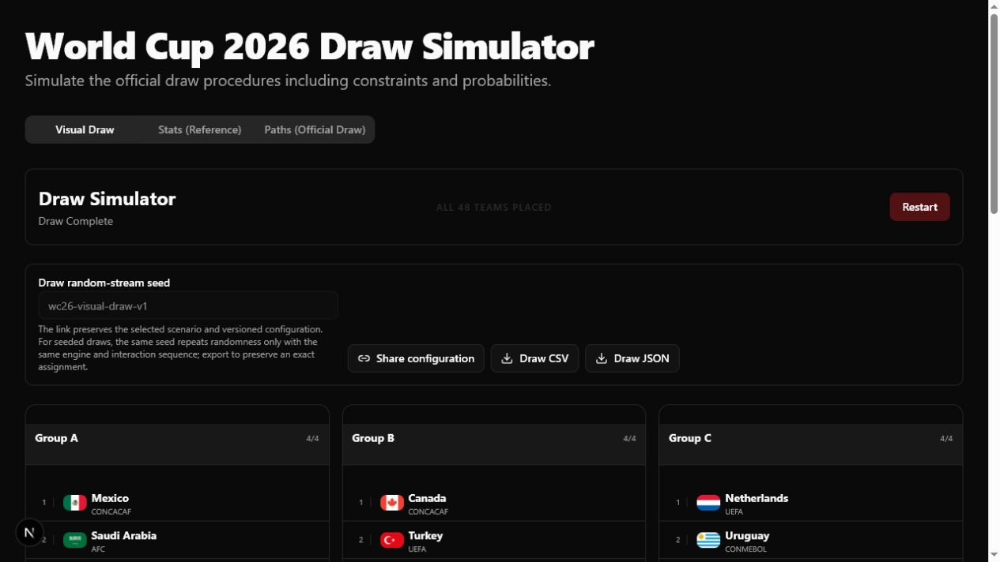
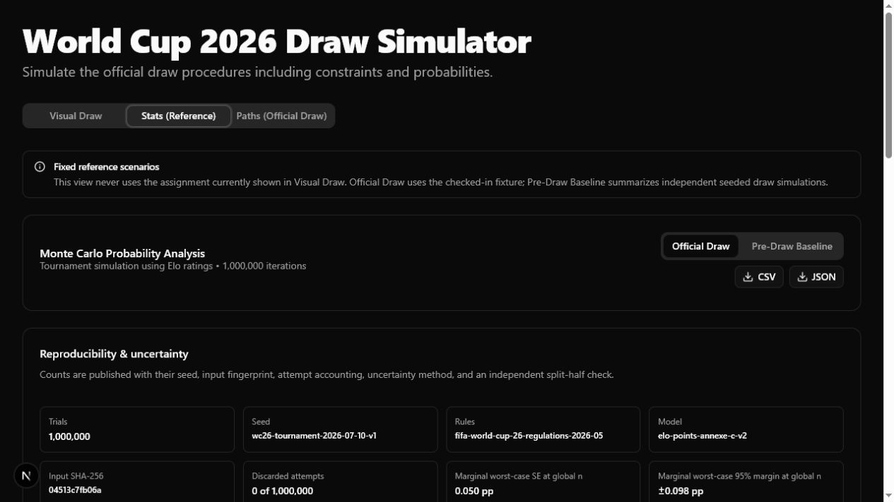
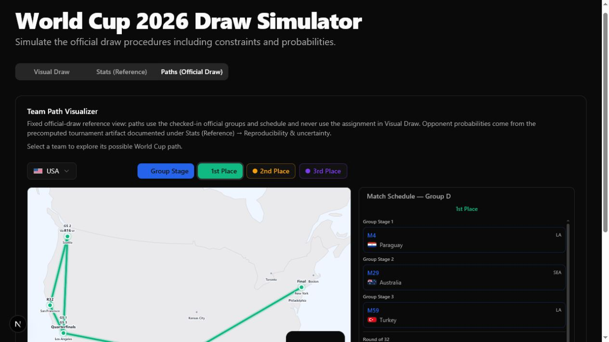

# FIFA World Cup 2026 Draw Simulator

[](https://github.com/BenDotWillcox/world-cup-draw/actions/workflows/ci.yml)
[](https://bendotwillcox.github.io/world-cup-draw/)
[](LICENSE)

An interactive, client-side model of the published FIFA World Cup 2026 Final Draw procedure, plus seeded Monte Carlo summaries and official-draw travel/path exploration.

The scoped claim is: **for the checked-in rule and input snapshots, the tested engine produces draws that satisfy the invariants listed below across its regression fixtures, deterministic seed sweeps, and generated property tests.** This is not an official FIFA product, a formal proof of every possible state, a claim that samples are uniform over all legal draws, or a live tournament forecast.

[Open the live app](https://bendotwillcox.github.io/world-cup-draw/)

## What the three views mean

| View | Scenario | Does it use the draw made in Visual Draw? |
| --- | --- | --- |
| **Visual Draw** | A freshly randomized draw by default, an optional replay seed, or the fixed official draw when that option is selected | It is the source draw |
| **Stats (Reference) — Pre-Draw Baseline** | Aggregate probabilities across seeded generated draws | No; it summarizes the precomputed simulation artifact |
| **Stats (Reference) — Official Draw** | Elo-based tournament simulation from the checked-in official draw | No; it intentionally uses the official fixture |
| **Paths (Official Draw)** | Match, venue, opponent, and travel paths from the checked-in official draw and schedule | No; it intentionally uses the official fixture |

A generated Visual Draw is therefore never carried into either reference view. The normal flow creates a fresh seed for each new draw; export it or share its active seeded configuration from the controls below the draw if you want to preserve that scenario.

## Screenshots

### Visual Draw



### Stats (Reference)



### Paths (Official Draw)



## Rule model

The rule snapshot implements these draw invariants:

- 48 unique entries, split into four pots of 12, produce 12 groups of four.
- Each group receives exactly one team from every pot, in the position prescribed by FIFA's Appendix B allocation pattern.
- Mexico is fixed at A1, Canada at B1, and the USA at D1.
- Spain/Argentina and France/England are placed on opposite bracket pathways under the published Pot 1 competitive-balance constraint.
- A group may contain at most one team from each non-UEFA confederation.
- Every group contains at least one and at most two UEFA teams.
- A FIFA Play-Off placeholder is checked conservatively against every confederation that could win its pathway, in both placement directions.

### How the solver works

Pot 1 is handled separately because of the three fixed hosts and the two opposite-pathway pairs. For Pots 2–4, the engine places a shuffled team into its Appendix B position and recursively explores legal groups. When a branch cannot place the remaining teams, it undoes that placement and tries the next branch.

During an interactive draw, Pot 1 placements are checked against the fixed-host reservations and opposite-pathway rules. For Pots 2–4, each prospective placement also receives a chained backtracking feasibility pass over the remaining teams in those pots; that prevents the UI from accepting a locally legal later-pot placement that leaves no legal completion. Fast Forward uses the full completion solver from the retained partial draw, and an impossible input produces an explicit failure rather than a partial result.

The million-trial pre-draw generator uses a separate allocation-optimized engine with compact confederation masks and rejection/retry behavior. Tests cross-check its aggregate invariants against the rule model. Its traversal and retry scheme **is not claimed to sample uniformly from the set of all legal draws**; probabilities describe this implementation's seeded sampling process.

Key implementation areas:

| Area | Files |
| --- | --- |
| Backtracking draw and completion | [`lib/engine/draw-logic.ts`](lib/engine/draw-logic.ts) |
| High-throughput pre-draw simulation | [`lib/engine/fast-sim.ts`](lib/engine/fast-sim.ts) |
| Tournament simulation | [`lib/engine/tournament-sim.ts`](lib/engine/tournament-sim.ts) |
| Interactive state and validation | [`components/draw/DrawContext.tsx`](components/draw/DrawContext.tsx) |
| Teams, official draw, schedule, and Elo capture | [`lib/data`](lib/data) |
| Invariants and regression fixtures | [`tests`](tests) |

## Source and version provenance

All application inputs are static snapshots, not live feeds. Version identifiers live in [`lib/data/simulation-metadata.ts`](lib/data/simulation-metadata.ts), and generated artifacts include the relevant identifiers plus a SHA-256 hash and file list for the exact input snapshot. Source text is normalized to LF before hashing so the same snapshot has one digest on Windows and Linux.

| Input | Repository version | Primary source / capture note |
| --- | --- | --- |
| Draw rules | `fifa-final-draw-2025-11-25` | FIFA's [Draw Procedures PDF](https://digitalhub.fifa.com/m/2d1a1ac7bab78995/original/Draw-Procedures-for-the-FIFA-World-Cup-2026.pdf) and [procedures/pots announcement](https://inside.fifa.com/organisation/media-releases/procedures-final-draw-world-cup-2026-revealed), published **25 November 2025** |
| Pot/team snapshot | `fifa-pots-2025-11-19-reconciled-2026-04-02` | Pots were based on FIFA's **19 November 2025** men's ranking: [ranking release](https://inside.fifa.com/fifa-world-ranking/men/news/coca-cola-mens-world-ranking-november-2025-brazil-spain). The six path winners were reconciled against FIFA's **31 March 2026** [qualified-teams list](https://www.fifa.com/en/tournaments/mens/worldcup/canadamexicousa2026/articles/world-cup-2026-who-has-qualified), [UEFA play-off final review](https://www.fifa.com/en/tournaments/mens/worldcup/canadamexicousa2026/articles/european-qualifiers-play-off-final-review), and [FIFA Play-Off Tournament review](https://www.fifa.com/en/articles/play-off-tournament-review); the repository snapshot is dated **2 April 2026** |
| Official draw fixture | `fifa-final-draw-2025-12-05-reconciled-2026-04-02` | FIFA's [Final Draw results](https://www.fifa.com/en/tournaments/mens/worldcup/canadamexicousa2026/articles/final-draw-results) from **5 December 2025**, with the same six **31 March 2026** play-off winners reconciled in the repository on **2 April 2026** |
| Tournament rules | `fifa-world-cup-26-regulations-2026-05` | FIFA's [May 2026 tournament regulations](https://digitalhub.fifa.com/m/636f5c9c6f29771f/original/FWC2026_regulations_EN.pdf), including the 495-option Annexe C table for assigning the eight best third-placed teams |
| Tournament model | `elo-points-annexe-c-v2` | Project model layered on the official format: captured Elo inputs, points-only group simulation with documented tie simplification, exact Annexe C assignment, and an Elo-weighted knockout bracket |
| Match/venue schedule | Static checked-in schedule; no separate repository version constant yet | FIFA's [104-match schedule release](https://www.fifa.com/en/tournaments/mens/worldcup/canadamexicousa2026/articles/updated-fifa-world-cup-2026-match-schedule-now-available), published **6 December 2025** |
| Elo ratings | `world-football-elo-captured-2026-04-02` | A **captured third-party input** from [World Football Elo Ratings](https://eloratings.net/) on **2 April 2026**. It is not FIFA data, is not fetched live, and the source site is not an immutable historical snapshot; the repository version and artifact input hash identify the values actually used |

The repository's `rank` field identifies the pot-order snapshot; tournament strength comes from the separate captured Elo table. Updating a source requires updating the checked-in data, its version constant, affected fixtures, and generated artifacts together.

## Reproduce locally

Requirements: Node.js 20 and npm.

```bash
git clone https://github.com/BenDotWillcox/world-cup-draw.git
cd world-cup-draw
npm ci
npm run dev
```

Then open <http://localhost:3000>.

Create a production static export with:

```bash
npm run build
```

### Reproduce the one-million-trial artifacts

The default checked-in seeds are deliberately public. These commands overwrite the tracked simulation JSON files:

```bash
npm run generate:draw-stats -- --seed wc26-pre-draw-2026-07-10-v1 --trials 1000000
npm run generate:tournament-stats -- --seed wc26-tournament-2026-07-10-v1 --trials 1000000
```

The draw command writes the canonical [`lib/data/pre-draw-monte-carlo.json`](lib/data/pre-draw-monte-carlo.json) and refreshes [`lib/data/monte-carlo-results.json`](lib/data/monte-carlo-results.json) as a byte-identical Path Visualizer compatibility copy. The tournament command writes [`lib/data/tournament-sim-results.json`](lib/data/tournament-sim-results.json).

Each generated artifact records:

- schema and generation timestamp;
- seed, derived batch seeds, requested trials, successful iterations, attempts, and rejections where applicable;
- rule/input/Elo version identifiers;
- input file list and SHA-256 digest;
- binomial standard-error and 95% Wilson-interval methodology;
- split-half convergence result, measured maximum absolute delta, threshold, and number of metrics compared; and
- the exact reproducible command.

Use a different `--seed` to create an independent deterministic run or a smaller `--trials` value for a quick local check. The seeded PRNG hashes the string seed with FNV-1a and expands it with Mulberry32; it is reproducible, not cryptographically secure.

## Monte Carlo methodology

### Pre-draw

Each accepted trial creates one complete draw, then increments team-by-group and team-by-opponent counts. Probabilities are counts divided by successful trial count. Host placements, pot membership, opposite pathways, confederation caps, and playoff-path confederations are enforced on every accepted draw.

### Post-draw tournament

Each trial starts from the fixed official groups, simulates the six round-robin matches in every group, selects the top two plus eight third-placed teams, applies the exact one of FIFA Annexe C's 495 assignments for those qualifying groups, and simulates the knockout bracket. The artifact exposes attempts and discarded-result counts; the checked-in model expects no discarded attempts once a valid Annexe C combination has been selected.

Group-match win/draw/loss probabilities use the checked-in Elo ratings with a 60-point draw margin. Knockout matches use the Elo expected-score probability and directly select a winner, abstracting extra time and penalties. Host teams receive a fixed +100 Elo adjustment. Equal points are currently resolved by a seeded random tie key rather than FIFA's complete sporting tie-break sequence.

### Uncertainty and convergence

For every displayed event, the app reports or exposes the Monte Carlo standard error and a 95% Wilson interval. Conditional knockout-opponent and path estimates use the number of times the selected team reached that round or match as their effective sample size, which the UI and CSV export report explicitly. At one million successful Bernoulli trials, the worst-case standard error for a global marginal is about **0.05 percentage points** and the worst-case 95% margin of error is about **0.10 percentage points**.

Those intervals measure finite-simulation noise only. They do not cover input error, model misspecification, non-uniform draw sampling, dependence or multiplicity across the many displayed events, future data changes, or uncertainty in Elo ratings. A split-half maximum-absolute-difference check is saved with each artifact as a practical stability diagnostic; passing it is not proof of convergence or model validity.

## Validation contract

`npm test` exercises the public invariants rather than relying on a single happy-path snapshot:

- the input contains 48 unique teams and four pots of 12;
- every completed draw contains every team exactly once in 12 groups of four;
- every team occupies its pot's Appendix B position;
- host placement and both opposite-pathway pairs hold;
- one-to-two UEFA and non-UEFA confederation caps hold;
- all possible FIFA Play-Off pathway confederations remain binding;
- randomized partial valid draws can be completed without moving retained teams;
- impossible states return `null`/`false` or throw the documented stable error without mutating the input;
- deterministic seed sweeps exercise complete draws and partial completions;
- `fast-check` generates and shrinks arbitrary random-stream seeds and valid retained-team subsets for property-based invariant checks;
- the checked-in official draw matches an independent JSON regression fixture and satisfies the same invariants; and
- the optimized simulation is deterministic for a fixed seed and preserves aggregate placement/opponent invariants.

`npm run test:golden` adds a small fixed-seed exact-output/hash regression for generator reproducibility. The official fixture and golden run catch drift; neither is treated as an independent proof that FIFA's procedure was modeled perfectly.

The coverage contract is behavioral: the invariants above, official regression fixture, deterministic seed sweeps, generated property tests, impossible-state behavior, and golden artifacts are CI gates. There is currently no numeric line/branch coverage threshold; that omission is explicit rather than an implied 100% coverage claim.

Run the same checks as CI:

```bash
npm run check       # lint + typecheck + tests + golden run + published-artifact contract
npm run build       # Next.js production/static-export check
```

Or run a gate independently:

```bash
npm run lint
npm run typecheck
npm test
npm run test:golden
npm run test:artifacts
```

GitHub Actions runs on Node 20 in [`.github/workflows/ci.yml`](.github/workflows/ci.yml) and gates lint, typecheck, invariants, deterministic golden output, and the production build. [`.github/workflows/deploy.yml`](.github/workflows/deploy.yml) publishes the static export from `main` to GitHub Pages.

## Export and sharing

- **Visual Draw:** export a normalized team-assignment CSV and a JSON manifest containing the scenario and provenance metadata.
- **Stats (Reference):** export the displayed probability table as CSV or the complete count/metadata artifact as JSON.
- **Share:** copy a URL containing the selected Visual Draw scenario plus its seed (when applicable), rule version, input version, and engine version, for example `?tab=visualizer&scenario=seeded&seed=...&rules=...&input=...&engine=...` or `?tab=visualizer&scenario=official&...`.

The shared URL restores either seeded mode or the fixed official-draw mode. For seeded mode it preserves deterministic configuration, not a unique assignment: the same seed repeats the random stream only when the engine version and interaction sequence (step-by-step versus Fast Forward) also match. It does **not** serialize later manual placements or edits; use the Visual Draw exports when the exact assignment matters. A mismatched rule/input/engine version is a different scenario, even when the seed text is the same.

## Known limitations

- This project is independent, unofficial, and based on dated static snapshots. It does not ingest live qualification, schedule, rating, injury, lineup, form, or tournament-result data.
- The constrained draw sampler is reproducible but is not established as uniform over legal draws. Pre-draw probabilities should not be interpreted as FIFA-certified odds.
- Elo is a captured third-party input, not an official rating or a calibrated forecasting guarantee. The +100 host adjustment and 60-point draw margin are model assumptions.
- Tournament simulation uses points plus a random tie key, not the complete FIFA group tie-break sequence, and abstracts knockout extra time and penalties into a single Elo-weighted result.
- Monte Carlo intervals quantify sampling error inside this model only; they do not quantify total predictive uncertainty.
- Play-off pathways are modeled conservatively for draw eligibility by applying every possible confederation in the path.
- Stats (Reference) and Paths (Official Draw) intentionally use precomputed/fixed scenarios and never consume a newly generated Visual Draw.
- Travel totals use Haversine distance between checked-in host-city coordinates and calendar-day gaps. They are route approximations, not team itineraries, flight distances, or recovery forecasts.
- The match schedule does not yet have its own repository version constant, and the finite test suite is not a formal verification of every reachable state.

## License

[MIT](LICENSE) © 2025 Ben Dot Willcox.
